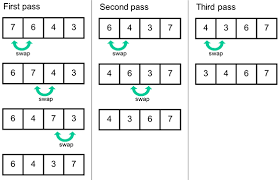

# Bubble Sort

Bubble sort is the simplest sorting algorithm that works by swapping the adjacent elements if they are in the wrong order.
Bubble sort iterates over the array, then starts another iteration in the same array to compare every element to the element of the first looping. If the element from the first looping is lower than the second looping element, then it swaps the elements. By doing that to the end of the array the Bubble sort will be done.
As a consequence of iterating each individual elements in its array many times, it has a quite high average and worst-case time complexity, which makes this algorithms not suitable for large data sets
I would recommend you to check the 