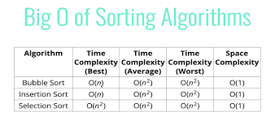

# Sorting Algorithms

Algorithms are a set of **well-defined instructions or rules** to solve a goal. Sorting algorithms is not different, it is a set of instructions which takes a list as a parameter and returns it sorted.

> In the picture, there are a table, showing the difference between some and common sorting algorithms, comparing them by their Best, Average, and Worst Time Complexity. Finishing by the Space Complexity

